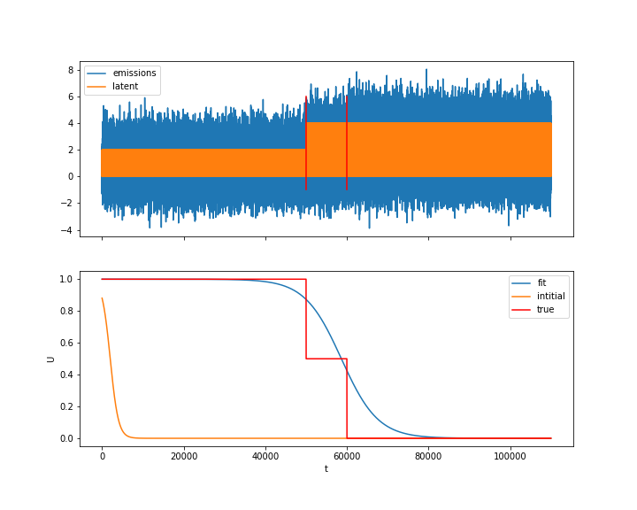
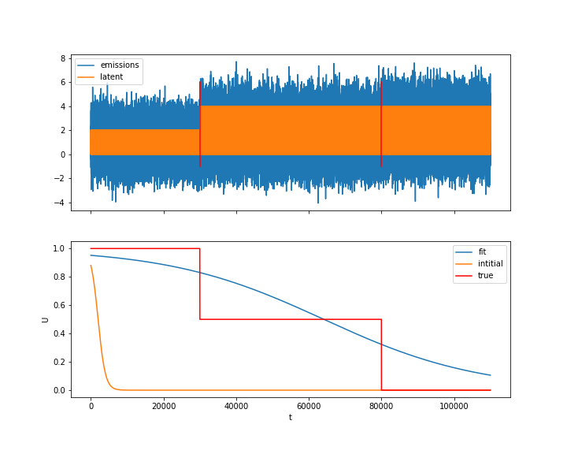

sb_hmmlearn
========

Modification of the hmmlearn package to allow inference of dynamic modulation between two transition matrices. See original hmmlearn package for dependencies ((https://github.com/hmmlearn/hmmlearn).

sb_hmm is designed to study non-equilibrium behaviors in hidden markov models (hmm).
We start with a hidden markov system with equilibrium transition matrix A0.
The transition matrix is assumed to be perturbed from equilibrium by a matrix A1.
This could be viewed as the suppression of one or more latent states (eg. A1 reduces transitions into those latent states).
We assume that the system equilibriates back to A0 such that the transition matrix
at any time point can be written as:

The goal is to estimate Ut. Currently we have implemented several c-level optimization
scripts to optimize U as a sigmoid function.

## Demo
As a brief demo, we use the hmmlearn package to generate synthetic data from an original transition matrix A0,
 and perturbed matrices (A0+A1)$, and $(A0+A1/2)$. By appending this data, we
 create the equivalent of a 3 level step function for U. We then build an sb_hmm object
 and fit for U using the synthetic data. Results given below:

As and example of it's generalization, we show that the algorithm can fit for not only location,
but breadth of transition by change in duration of the different simulated matrices:

See example/2phasetest.py and 3phase_test.py for example coding.

## Disclaimer
This code is not peer reviewed and provided on an as-is basis. Also note, you may
have to change the time scaling of U parameters a and b, as I wrote some lines specific
to my data. Sorry

## Authors

* **Samuel Bray**

## License

This project is licensed under GNUV3
